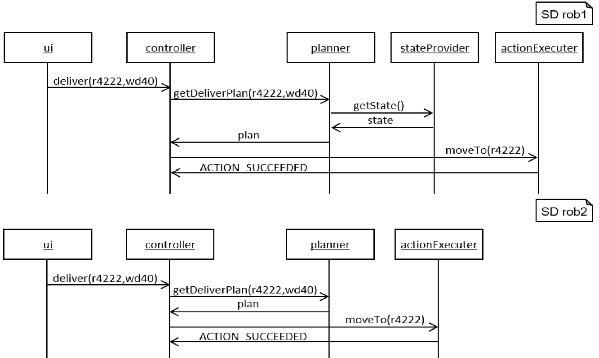

<!-- (c) https://github.com/MontiCore/monticore -->

This documentation is intended for  **modelers** who use the sequence diagram (SD) languages.
A detailed documentation for **language engineers** using or extending the SD language is 
located **[here](src/main/grammars/de/monticore/lang/sd4development.md)**.
We recommend that **language engineers** read this documentation before reading the detailed
documentation.

# An Example Model


<br><b>Figure 1:</b> The graphical syntax of an example SD.

&nbsp;  

Figure 1 depicts the SD ```bid``` in graphical syntax. In textual syntax, 
the SD is defined as follows:

``` 
sequencediagram Bid {

  kupfer912:Auction;
  bidPol:BiddingPolicy;
  timePol:TimingPolicy;
  theo:Person;

  kupfer912 -> bidPol : validateBid(bid) {
    bidPol -> kupfer912 : return BiddingPolicy.OK;
  }
  kupfer912 -> timePol : newCurrentClosingTime(kupfer912,bid) {
    timePol -> kupfer912 : return t;
  }
  assert t.timeSec == bid.time.timeSec + extensionTime;
  let int m = theo.messages.size;
  kupfer912 -> theo : sendMessage(bm) {
    theo -> kupfer912 : return;
  }
  assert m + 1 == theo.messages.size;
}
```

This was for us the most intuitive textual representation of SDs, which was not 
easy to define, because SDs are inherently two dimensional with their 
objects, activity bars and interactions in time.

# Command Line Interface (CLI)

This section describes the CLI tool of the SD language. 
The CLI tool provides typical functionality used when
processing models. To this effect, it provides funcionality
for 
* parsing, 
* coco-checking, 
* pretty-printing, 
* creating symbol tables, 
* storing symbols in symbol files, 
* loading symbols from symbol files, and 
* semantic differencing. 

The requirements for building and using the SD CLI tool are that Java 8, Git, and Gradle are 
installed and available for use in Bash. 

The following subsection describes how to download the CLI tool.
Then, this document describes how to build the CLI tool from the source files.
Afterwards, this document contains a tutorial for using the CLI tool.  

## Downloading the Latest Version of the CLI Tool
A ready to use version of the CLI tool can be downloaded in the form of an executable JAR file.
You can use [**this download link**](http://monticore.de/download/SD4DevelopmentCLI.jar) 
for downloading the CLI tool. 

Alternatively, you can download the CLI tool using `wget`.
The following command downloads the latest version of the CLI tool and saves it under the name `SD4DevelopmentCLI` 
in your working directory:
```
wget "http://monticore.de/download/SD4DevelopmentCLI.jar" -O SD4DevelopmentCLI.jar
``` 

## Building the CLI Tool from the Sources
 
It is possible to build an executable JAR of the CLI tool from the source files located in GitHub.
The following describes the process for building the CLI tool from the source files using Bash.
For building an executable Jar of the CLI with Bash from the source files available
in GitHub, execute the following commands.

First, clone the repository:
```
git clone https://github.com/MontiCore/sequence-diagram.git
```
Change the directory to the root directory of the cloned sources:
```
cd sequence-diagram
```
Afterwards, build the source files with gradle (if `./gradlew.bat` is not recognized as a command in your shell, then use `./gradlew`):
```
./gradlew.bat build
```
Congratulations! You can now find the executable JAR file `SD4DevelopmentCLI.jar` in
 the directory `target/libs` (accessible via `cd target/libs`).

## Tutorial: Getting Started Using the SD CLI Tool
The previous sections describe how to obtain an executable JAR file
(SD CLI tool). This section provides a tutorial for
using the SD CLI tool. The following examples assume
that you locally named the CLI tool `SD4DevelopmentCLI`.

### First Steps
Executing the Jar file without any options prints usage information of the CLI tool to the console:
```
java -jar SD4DevelopmentCLI.jar
usage: SD4DevelopmentCLI
 -c,--coco <arg>            Checks the CoCos for the input FDs. Possible
                            arguments are 'intra',  'inter', and 'type'. When
                            given the argument 'intra', only the intra-model
                            CoCos are checked. When given the argument 'inter',
                            only the intra- and inter-model CoCos are checked.
                            When given the argument 'type', all CoCos are
                            checked. When no argument is specified, all CoCos
                            are checked by default.
 -h,--help                  Prints this help dialog.
 -i,--input <arg>           Processes the SD input artifacts specified as
                            arguments. At least one input SD is mandatory.
 -path <arg>                Sets the artifact path for imported symbols, space
                            separated.
 -pp,--prettyprint <file>   Prints the input SDs to stdout or to the specified
                            files (optional).
 -s,--symboltable <arg>     Stores the serialized symbol tables of the input SDs
                            in the specified files. The n-th input SD is stored
                            in the file as specified by the n-th argument. If no
                            arguments are given, the serialized symbol tables
                            are stored in
                            'target/symbols/{packageName}/{artifactName}.sdsym'
                            by default.
 -sd,--semdiff              Computes a diff witness contained in the semantic
                            difference from the first input SD to the second
                            input SD if one exists and prints it to stdout.
                            Requires exactly two  SDs as inputs. If no diff
                            witness exists, it prints that the first SD is a
                            refinement  of the second SD to stdout.
```
To work properly, the CLI tool needs the mandatory argument `-i,--input <arg>`, which takes the file paths of at least one input file containing SD models.
If no other arguments are specified, the CLI tool solely parses the model(s).

For trying this out, copy the `SD4DevelopmentCLI.jar` into a directory of your choice. 
Afterwards, create a text file containing the following simple SD:
```
sequencediagram Example {
}
```

Save the text file as `Example.sd` in the directory where `SD4DevelopmentCLI.jar` is located. 

Now execute the following command:
```
java -jar SD4DevelopmentCLI.jar -i Example.sd
```

You may notice that the CLI tool prints no output to the console.
This means that the tool has parsed the file `Example.sd` successfully.

### Step 2: Pretty-Printing
The CLI tool provides a pretty-printer for the SD language.
A pretty-printer can be used, e.g., to fix the formatting of files containing SDs.
To execute the pretty-printer, the `-pp,--prettyprint` option can be used.
Using the option without any arguments pretty-prints the models contained in the input files to the console.

Execute the following command for trying this out:
```
java -jar SD4DevelopmentCLI.jar -i Example.sd -pp
```
The command prints the pretty-printed model contained in the input file to the console:
```
sequencediagram Example {
}
```

It is possible to pretty-print the models contained in the input files to output files.
For this task, it is possible to provide the names of output files as arguments to the `-pp,--prettyprint` option.
If arguments for output files are provided, then the number of output files must be equal to the number of input files.
The i-th input file is pretty-printed into the i-th output file.

Execute the following command for trying this out:
```
java -jar SD4DevelopmentCLI.jar -i Example.sd -pp PPExample.sd
```
The command prints the pretty-printed model contained in the input file into the file `PPExample.sd`.

### Step 3: Checking Context Conditions
For checking context conditions, the `-c,--coco <arg>` option can be used. 
Using this option without any arguments checks whether the model satisfies all context conditions. 

If you are only interested in checking whether a model only satisfies a subset of the context conditions or want to explicate that all context conditions shoud 
be checked, you can do this by additionally providing one of the three
 arguments `intra`, `inter`, and `type`.
* Using the argument `intra` only executes context conditions concerning violations of intra-model context conditions.
  These context conditions, for example, check naming conventions. 
* Using the argument `inter` executes all intra-model context conditions and additionally checks whether imported `Variables`, i.e., objects, are defined.
* Using the argument `type` executes all context coniditions. These context conditions include checking whether
  used types and methods exist. The behavior when using the argument `type` is the equal to the default behavior when using no arguments. 

Execute the following command for trying out a simple example:
```
java -jar SD4DevelopmentCLI.jar -i Example.sd -c
```
You may notice that the CLI prints nothing to the console when executing this command.
This means that the model satisfies all context condtions. 

Let us now consider a more complex example.
Recall the SD `Bid` from the `An Example Model` section above.
For continuing, copy the textual representation of the SD `Bid` and save it in a 
file `Bid.sd` in the directory where the file `SD4DevelopmentCLI.jar` is located.

You can check the different kinds of context conditions, using the `-c,--coco <arg>` option:
```
java -jar SD4DevelopmentCLI.jar -i Bid.sd -c intra
```
```
java -jar SD4DevelopmentCLI.jar -i Bid.sd -c inter
```
```
java -jar SD4DevelopmentCLI.jar -i Bid.sd -c type
```
After executing the last command, you may notice that the CLI tool produces some output.
The output states the reasons why a few context conditions are not satisfied by the model.
For instance, the output contains the following error message: 
```
... ERROR ROOT - Bid.sd:<3,2>: 0xB0028: Type 'Auction' is used but not defined.
```
The error message indicates that there is a problem in the third line, i.e., there seems to be a problem with the statement `kupfer912:Auction;`.
And indeed, the tool tries to load some type information about the `Auction` type.
However, we never defined this type at any place, and therefore the tool is not able to find any information of the `Auction` type.

There must be another model defining the type `Auction`. 
The model must provide the information about the definition of this type to its 
environment via storing this information in its symbol file (its symbol table stored in the file system).

The symbol file of this model has to be imported by the SD model for accessing the type.
For the SD language, we have not fixed a language for defining types.
Instead, the types can be defined in arbitrary models of arbitrary languages, as long as
the information about the definitions of the types are stored in the symbol files of the models
and the SD imports these symbol files. 
This may sound complicated at this point, but conceptually it is actually quite simple. 
This has even a huge advantage because it allows us to use the SD language with any other 
language that defines types. You could even use languages that are not 
defined with MontiCore, as long as suitable symbol files are generated 
from the models of these languages.

The following subsection describes how to fix the error in the example model `Bid.sd` 
by importing a symbol file defining the (yet undefined) types. 

### Step 4: Using the Model Path to Resolve Symbols

In this section we make use of the model path and provide the CLI tool with
a symbol file (stored symbol table) of another model, which contains the necessary type information.

Create a new directory `mytypes` in the directory where the CLI tool `SD4DevelopmentCLI.jar` is located.
The symbol file `Types.typesym` of a model, which provides all necessary type information, can be found [here](doc/Types.typesym).
Download the file, name it `Types.typesym`, and move it into the directory `mytypes`.

The contents of the symbol file are of minor importance for you as a language user. 
In case you are curious and had a look into the symbol file: 
The symbol file contains a JSON representation of the symbols defined in a model.
In this case, the symbol file contains information about defined types. 
Usually, the CLI tools of MontiCore languages automatically generate the contents of these files and
you, as a language user, must not be concerned with their contents. 
  
The path containing the directory structure that contains the symbol file is called the "Model Path".
If we provide the model path to the tool, it will search for symbols in symbol files, which are stored in directories contained in the model path.
So, if we want the tool to find our symbol file, we have to provide the model path to the tool via the `-path <arg>` option:
```
java -jar SD4DevelopmentCLI.jar -i Bid.sd -c type -path <MODELPATH>
```
where `<MODELPATH>` is the path where you stored the downloaded symbol file.
In our example, in case you stored the model in the directory `mytypes`,
execute the following command:
```
java -jar SD4DevelopmentCLI.jar -i Bid.sd -c type -path mytypes
```

Well, executing the above command still produces the same error message.
This is because the symbol file needs to be imported first, just like in Java.
Therefore, we add the following import statement to the beginning of the contents contained 
in the file `Bid.sd` containing the SD `Bid`:
```
import Types.*;

sequencediagram Bid {
  ...
}
```
The added import statement means that the file containing the SD imports all symbols that 
are stored in the symbol file `Types`. 
Note that you may have to change the name here, depending on how you named the symbol file from above.
The concrete file ending `.typesym` is not important 
in this case. However, the file ending of the symbol file must end with `sym`, i.e., the name of the 
symbol file must be compatible to the pattern `*.*sym`.
If you strictly followed the instructions of this tutorial, then you are fine.

If we now execute the command again, the CLI tool will print no output. This means that it processed 
the model successfully without any context condition violations.
Great! 

### Step 5: Storing Symbols
The previous section describes how to load symbols from an existing symbol file.
Now, we will use the CLI tool to store a symbol file for our `Bid.sd` model.
The stored symbol file will contain information about the objects defined in the SD.
It can be imported by other models for using the symbols introduced by these object definitions,
similar to how we changed the file `Bid.sd` for importing the symbols contained in the
symbol file `Types.typessym`.

Using the `-s,-symboltable <arg>` option builds the symbol tables of the input models and stores them in the file paths given as arguments.
Either no file paths must be provided or exactly one file path has to be provided for each input model.
The symbol file for the i-th input model is stored in the file defined by the i-th file path. 
If you do not provide any file paths, the CLI tool stores the symbol table of each input model 
in the symbol file `target/symbols/{packageName}/{fileName}.sdsym` 
where `packageName` is the name of the package as specified in the file containing 
the model and `fileName` is the name of the file containing the model. The file is stored relative 
to the working directory, i.e., the directory in which you execute the command for storing the symbol files.
Furthermore, please notice that in order to store the symbols properly, the model has to be well-formed in all regards, and therefore all context conditions are checked beforehand.

For storing the symbol file of `Bid.sd`, execute the following command 
(the implicit context condition checks require using the model path option):
```
java -jar SD4DevelopmentCLI.jar -i Bid.sd -path mytypes -s
```
The CLI tool produces the file `target/symbols/Bid.sdsym`, which can now be imported by other models, e.g., by models that need to
use some of the objects defined in the SD `Bid`.

For storing the symbol file of `Bid.sd` in the file `syms/BidSyms.sdsym`, for example, execute the following command
(again, the implicit context condition checks require using the model path option):
```
java -jar SD4DevelopmentCLI.jar -i Bid.sd -path mytypes -s syms/BidSyms.sdsym
```

Congratulations, you have just finished the tutorial about saving SD symbol files!

### Step 6: Semantic Differencing

Semantic differencing of SDs enables developers to detect differences in the meanings of the SDs.
The semantic difference from an SD `sd1` to an SD `sd2` is defined as the set of all system runs 
that are valid in `sd1` and not valid in `sd2`. A system run is a sequence of interactions between
objects. A system run is valid in an SD if the interactions stated in the SD are contained
in the system run in the order specified in the SD and the constraints induced by objects tagged with
stereotypes are satisfied. The system run may contain more interactions than specified
in the SD.
 
In this section, we consider the SDs [rob1.sd](src/test/resources/sddiff/rob1.sd) and [rob2.sd](src/test/resources/sddiff/rob2.sd).
Both SDs are graphically depicted the Figure 2.
Download the files containing the SDs (by using the links) and place them in the directory where the CLI tool `SD4DevelopmentCLI.jar`
is located. The file located [here](src/test/resources/sddiff/rob1.sd) should be named `rob1.sd` and the file 
located [here](src/test/resources/sddiff/rob2.sd) should be named `rob2.sd`.


<br><b>Figure 2:</b> Two sequence diagrams chosen for semantic differencing.

&nbsp;  

To calculate an element contained in the semantic difference from an SD to another SD, 
the CLI tool provides the `-sd,--semdiff` option.
For example, to calculate an element contained in the semantic difference from
the SD defined in the file `rob2.sd` to the SD defined in the file `rob1.sd`, execute 
the following command:

```
java -jar SD4DevelopmentCLI.jar -sd -i rob2.sd rob1.sd
```

The CLI prints the following output, which represents the interaction sequence of a system
run that is valid in the SD `rob2` and not valid in the SD `rob1`:
```
Diff witness:
ui -> controller : deliver(r4222,wd40),
controller -> planner : getDeliverPlan(r4222,wd40),
planner -> controller : plan,
planner -> stateProvider : getState(),
controller -> actionExecutor : moveTo(r4222),
actionExecutor -> controller : ACTION_SUCCEEDED
```

However, as the semantic difference operator is by no means commutative, swapping the arguments changes the result.
Execute the following command:
```
java -jar SD4DevelopmentCLI.jar -sd -i rob1.sd rob2.sd
```

This yield the following output:
```
The input SD 'rob1.sd' is a refinement of the input SD 'rob2.sd'
```

In this case, the CLI tool outputs that the SD `rob1.sd` is a refinement of the SD 
`rob2.sd`. This means that every system run that is valid in the SD `rob1` is 
also valid in the SD `rob2`. Thus, the semantic difference from `rob1` to `rob2` is empty.

You finished the tutorial on semantic SD differencing and are now ready to execute 
semantic evolution analysis via semantic differencing for arbitrary SDs. Great!

## Further Information

* [Project root: MontiCore @github](https://github.com/MontiCore/monticore)
* [MontiCore documentation](http://www.monticore.de/)
* [**List of languages**](https://github.com/MontiCore/monticore/blob/dev/docs/Languages.md)
* [**MontiCore Core Grammar Library**](https://github.com/MontiCore/monticore/blob/dev/monticore-grammar/src/main/grammars/de/monticore/Grammars.md)
* [Best Practices](https://github.com/MontiCore/monticore/blob/dev/docs/BestPractices.md)
* [Publications about MBSE and MontiCore](https://www.se-rwth.de/publications/)
* [Licence definition](https://github.com/MontiCore/monticore/blob/master/00.org/Licenses/LICENSE-MONTICORE-3-LEVEL.md)

