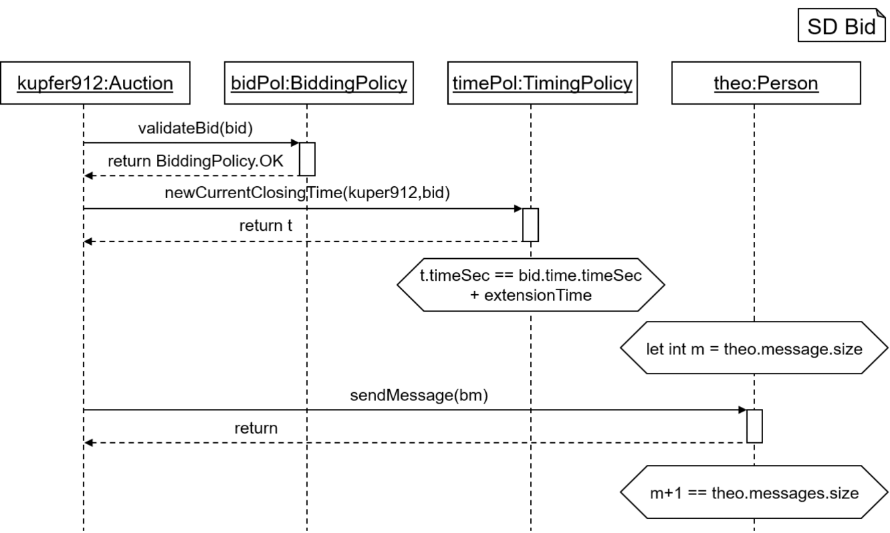
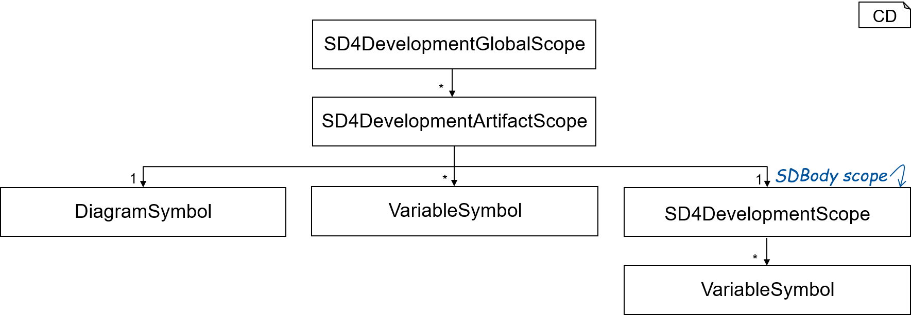
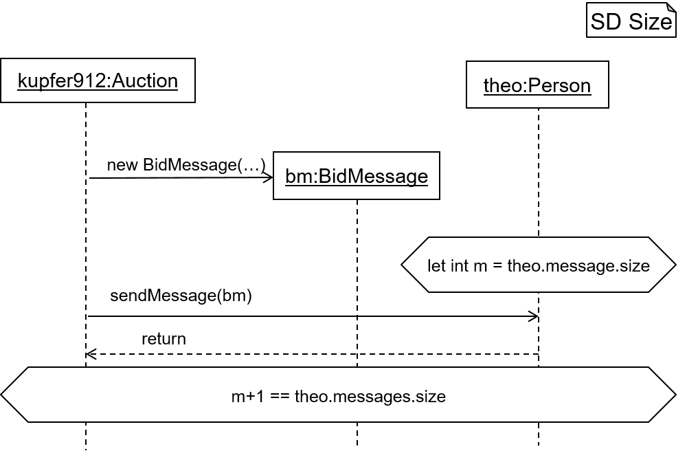
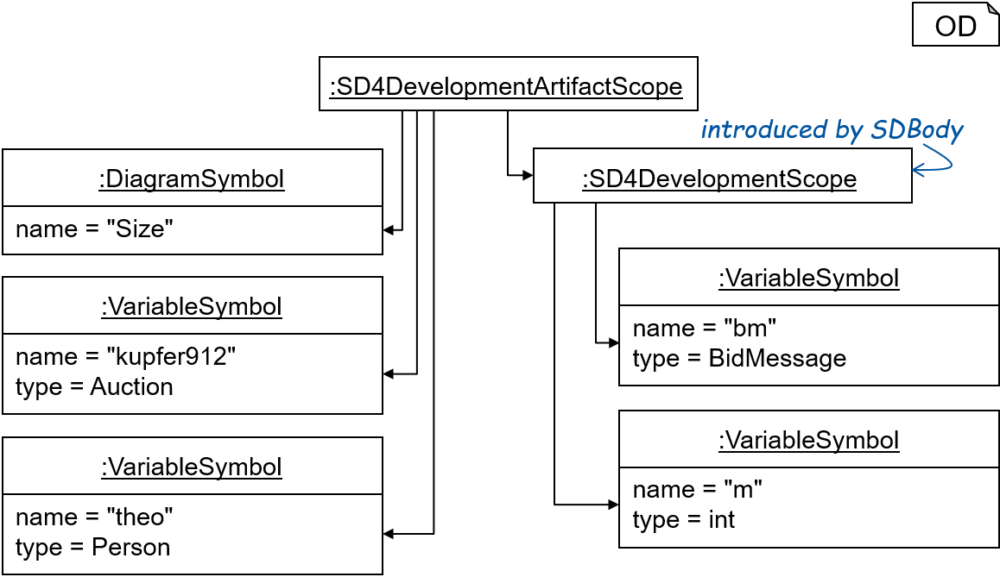

<!-- (c) https://github.com/MontiCore/monticore -->
<!-- Beta-version: This is intended to become a MontiCore stable explanation. -->

# Sequence Diagrams (UML/P SD)
The module descriped in this document defines a MontiCore language for 
UML/P SDs. UML/P SDs are a SD variant that is especially suited for the 
modeling of tests. UML/P SDs are defined in detail in 
the following books:
                      
    [Rum16] B. Rumpe: Modeling with UML:
    Language, Concepts, Methods. Springer International, July 2016.
                       
    [Rum17] B. Rumpe: Agile Modeling with UML:
    Code Generation, Testing, Refactoring. Springer International, May 2017.
                       
    see also: http://mbse.se-rwth.de/

This module contains 
* two grammars, 
* context conditions, 
* a symbol table infrastructure including functionality for 
  creating symbol tables and (de)-serializing symbol tables, and
* Pretty Printers. 

The following outline overviews the sections of this document.

## Example Model


<br><b>Figure 1:</b> The graphical syntax of an example SD.

&nbsp;  

Figure 1 depicts the SD ```bid``` in graphical syntax. In textual syntax, 
the SD is defined as follows:

``` 
sequencediagram Bid {

  kupfer912:Auction;
  bidPol:BiddingPolicy;
  timePol:TimingPolicy;
  theo:Person;

  kupfer912 -> bidPol : validateBid(bid) {
    bidPol -> kupfer912 : return BiddingPolicy.OK;
  }
  kupfer912 -> timePol : newCurrentClosingTime(kupfer912,bid) {
    timePol -> kupfer912 : return t;
  }
  assert t.timeSec == bid.time.timeSec + extensionTime;
  let int m = theo.messages.size;
  kupfer912 -> theo : sendMessage(bm) {
    theo -> kupfer912 : return;
  }
  assert m + 1 == theo.messages.size;
}
```

## Main Class ```SD4DevelopmentTool```


## Grammars
This module contains the two grammars SDBasis and SD4Development. 

### SDBasis
The grammar SDBasis contains the basic constituents to define textual 
representations of UML/P SDs. A detailed documentation of the grammar can 
be found in the artifact defining the grammar. 

The grammar SDBasis defines the syntax for 
* SD artifacts, 
* SDs, 
* SD match modifiers, 
* objects, and 
* interactions for sending messages.   
                            
The grammar SDBasis extends the grammars
* MCBasicTypes for adding the possibility to define objects typed as 
  MCObjectTypes.
* TypeSymbols to be able to use symbols of kind Variable and to enable 
  typechecking. Objects and local variables are added as variable symbols 
  to the symbol table.
* ExpressionsBasis to be able to reuse visitors for typechecking.
* UMLStereotype for adding UMLStereotypes as possible extension points to the grammar. 

### SD4Development
The grammar SD4Development extends the grammar SDBasis with advanced concepts 
used in object-oriented programming and embends OCL for defining local 
variables and stating conditions. A detailed documentation of the grammar can 
be found in the artifact defining the grammar. 

The grammar SD4Development defines the syntax for
* actions representing method calls,
* actions representing constructor calls,
* actions representing returns,
* actions representing the throw of an exception,
* interactions representing the end of method calls,
* classes as targets of interactions to model static method calls,
* ocl conditions, and
* local variable declarations.

The grammar SD4Development extends the grammars
* SDBasis to reuse the basic constituents of SDs,
* MCCommonLiterals to be able to common literals in expressions.
* CommonExpressions to be able to use simple expressions, e.g. a == b
* OCLExpressions for embedding OCL expressions as conditions and to be 
  able to use expressions for the definition of local variables.

## Context Conditions
This section lists the context conditions for the SDBasis grammar and the 
context conditions for the SD4Development grammar.

### SDBasis Context Conditions
The implementations of the context conditions for the SDBasis grammar are 
located here.

* The context condition ```CommonFileExtensionCoco```  checks if an artifact
containing an SD model has the common file ending ".sd" of SD artifacts.

* The context condition ```ObjectNameNamingConventionCoco``` checks the 
naming convention for objects in a SD, i.e., every object
name is not empty and starts with a lower case letter.

* The context condition ```PackageNameIsFolderNameCoco``` checks if the 
package names of SD artifacts corresponds to their actual 
locations in the file system.

* The context condition ```ReferencedObjectSourceDeclaredCoco``` checks 
if used source objects are declared before they are used.

* The context condition ```ReferencedObjectTargetDeclaredCoco``` checks 
if used target objects are declared before they are used.

* The context condition ```ReferencedTypeExistsCoco``` checks if used 
types are defined.

* The context condition ```SDNameIsArtifactNameCoco``` checks if the 
names of SDs are equal to the file names of the artifacts
containing the SDs.

* The context condition ```SendMessageHasSourceOrTargetCoco``` checks 
if SDSendMessage interactions have a source or a target.

* The context condition ```TypeNamingConventionCoco``` checks if the 
naming convention for types is satisfied, i.e. that type names start 
with upper case letters.

* The context condition ```UniqueObjectNamingCoco``` checks if every 
object defined in an SD has a unique name.

### SD4Development Context Conditions 
The implementations of the context conditions for the SD4Development grammar 
are located here.

* The context condition ```ConstructorObjectNameNamingConventionCoco``` 
checks if naming conventions for objects constructed with SDNew 
interactions are satisfied, i.e., the name is not empty and starts
with a lower case letter.

* The context condition ```CorrectObjectConstructionTypesCoco``` checks
if the type declared for an object instantiated with an SDNew interaction 
and the object's initialization type are compatible.

* The context condition ```EndCallHasSourceOrTargetCoco``` checks if 
EndCall interactions have a source or a target.

* The context condition ```MethodActionRefersToCorrectTargetCoco``` 
checks if a method action refers to a correct target, i.e., that 
static methods are only called on classes and that all other methods 
are called on objects.

* The context condition ```MethodActionValidCoco``` checks if a 
method action is valid, i.e., whether a method with a corresponding 
signature is defined for the type of the target of the interaction. 
The name of the method as well as the number and types of method 
parameters must be equal.

* The context condition ```ReturnOnlyAfterMethodCoco``` checks if 
a return action only appears after a corresponding method call.

## Symbol Table
The SD language introduces the ```SequenceDiagramSymbol```
symbol type. Additionally, the SD language uses the build-in
symbol type ```VariableSymbol``` and type symbol types of MontiCore. 

Each SD may define objects. Therefore, SDs may 
export ```VariableSymbols``` containing the information about the name 
and the type of the object. Possible types for objects are 
```MCObjectTypes```. Further, it is possible to dynamically instantiated 
variables via ```SDVariableDeclarations``` by using OCL expressions. 
Interactions may call methods of objects.
Therefore, for checking whether the types of objects and variables
are defined and for checking whether methods used in interactions are 
defined, SDs may import ```TypeSymbols``` and 
 ```OOTypeSymbols```. 

### Symbol Table Data Structure


<br><b>Figure 2:</b> The data structure of the symbol table of the SD language.

&nbsp;  

Figure 2 depicts the symbol table data structure of the ```SD4Development```
grammar. The ```SD4DevelopmentGlobalScope``` an 
```SD4DevelopmentArtifactScope``` for each artifact defining an SD. In each
of these artifacts, at most one SD can be defined and each SD introduces 
an ```SequenceDiagramSymbol```. Therefore, each 
```SD4DevelopmentArtifactScope``` is associated to exactly one 
```SequenceDiagramSymbol```. Each ```SequenceDiagramSymbol``` spans an 
```SD4DevelopmentScope```. This scope contains exactly one subscope, which 
is spanned by ```SDBody```. The scope associated to the ```SequenceDiagramSymbol```
contains a ```VariableSymbol``` for each object that is defined inside the 
SD. The scope spanned by ```SDBody``` contains a ```VariableSymbol``` for 
each object that is dynamically instantiated via ```SDNew``` and for each 
variable that is instantiated via ```SDVariableDeclaration```.  


<br><b>Figure 3:</b> The SD defines two objects and dynamically instantiated an object as well as a variable.

&nbsp;  

Figure 3 depicts the simple example SD ```Size```. The SD defines 
the two objects ```kupfer912:Auction``` and ```theo:Person```. Additionally,
it dynamically instantiated the object ```bm:BidMessage``` and the variable
```int m```. The following depicts the textual syntax of the SD:

```
sequencediagram Size {

  kupfer912:Auction;
  theo:Person;

  kupfer912 -> BidMessage bm = new BidMessage(...);
  let int m = theo.messages.size;
  kupfer912 -> theo : sendMessage(bm);
  theo -> kupfer912 : return;
  assert m + 1 == theo.messages.size;
}
```  

Figure 4 depicts the symbol table instance for the SD ```Size```. 
Figure 4 abstracts from the ```SD4DevelopmentGlobalScope``` and
 ```SD4DevelopmentArtifactScope``` instances. The two objects 
 ```kupfer912:Auction``` and ```theo:Person``` correspond to the ```VariableSymbol```
 instances linked to the ```SD4DevelopmentScope``` with the ```name``` attribute
 containing the value ```"Size"```. The dynamically instantiated object 
 ```bm:BidMessage``` and the variable ```int m``` correspond to the variable
 symbols of the other ```SD4DevelopmentScope```, which is introduced by
 ```SDBody```.    


<br><b>Figure 4:</b> Symbol table instance of the SD depicted in Figure 3.

&nbsp;  

The handwritten extensions of the symbol table creator of the ```SDBasis```
grammar can be found in the class ```SDBasisSymbolTableCreator```. The handwritten
extensions of the symbol table creator of the ```SD4Development``` grammar 
can be found in the class  ```SD4DevelopmentSymbolTableCreator```. 

### Serialization and De-serialization of Symbol Tables

The SD language uses the DeSer implementations as generated by MontiCore
without any handwritten extensions. The objects that are dynamically instantiated
with interactions via ```SDNew``` interactions and the local variables 
introduced via ```SDVariableDeclaration```  by using statements are not exported 
(they are defined in an unnamed inner scope introduced with ```SCBody```).
Therefore, the corresponding variable symbols are not serialized, i.e., they
are not part of the corresponding symbol file. For example, the following 
depicts the symbol file obtained from serializing the symbol table instance 
depicted in Figure 4:

```json
{
  "kind": "de.monticore.lang.sd4development._symboltable.SD4DevelopmentArtifactScope",
  "name": "size",
  "package": "examples.correct",
  "sequenceDiagramSymbols": [
    {
      "kind": "de.monticore.lang.sdbasis._symboltable.SequenceDiagramSymbol",
      "name": "examples.correct.size",
      "spannedScope": {
        "kind": "de.monticore.lang.sd4development._symboltable.SD4DevelopmentScope",
        "name": "size",
        "isShadowingScope": false,
        "variableSymbols": [
          {
            "kind": "de.monticore.types.basictypesymbols._symboltable.VariableSymbol",
            "name": "examples.correct.size.kupfer912",
            "type": {
              "kind": "de.monticore.types.check.SymTypeOfObject",
              "objName": "Auction"
            },
            "isReadOnly": false
          },
          {
            "kind": "de.monticore.types.basictypesymbols._symboltable.VariableSymbol",
            "name": "examples.correct.size.theo",
            "type": {
              "kind": "de.monticore.types.check.SymTypeOfObject",
              "objName": "Person"
            },
            "isReadOnly": false
          }
        ]
      }
    }
  ]
}
```


